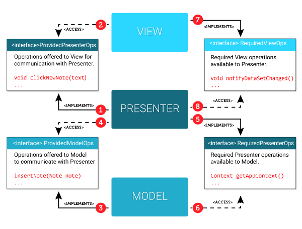

# Patr-n-MVP

El Modelo Vista Presentador (En español) es uno de los patrones de arquitectura de desarrollo más comunes y usados en el desarrollo nativo de Android. La necesidad de utilizar este patrón surge debido a lo complicado que puede llegar a ser el mantenimiento y escalamiento de un proyecto que va creciendo a lo largo del tiempo y líneas de código. El uso de esta arquitectura lleva a que cualquier persona pueda fácilmente mejorar, actualizar, modificar o arreglar cualquier parte de la aplicación. 

